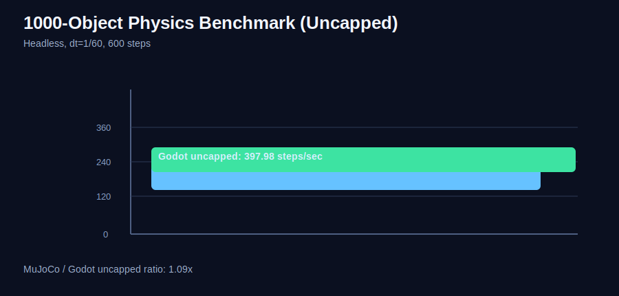

# godot-mujoco

Minimal C bridge exposing MuJoCo runtime calls for Godot integration.

## What is included

- Opaque handles for `mjModel` and `mjData` (`gmj_model`, `gmj_data`)
- Model lifecycle (`gmj_model_load_xml`, `gmj_model_free`)
- Data lifecycle (`gmj_data_create`, `gmj_data_free`, `gmj_reset_data`)
- Simulation stepping (`gmj_step`, `gmj_forward`)
- State/control getters and setters (`qpos`, `qvel`, `ctrl`)
- Name/ID lookup helpers for body/joint/actuator binding
- Batch slice APIs for `qpos`, `qvel`, and `ctrl` sync
- Body world position query (`gmj_body_world_position`)
- Lightweight error string retrieval (`gmj_last_mujoco_error`)

The API is declared in `include/godot_mujoco/gmj_bridge.h` and implemented in `src/gmj_bridge.c`.

## Build

```bash
cmake -S . -B build
cmake --build build
```

This creates `godot_mujoco_bridge` as a shared library (`.dylib`, `.so`, or `.dll`).

By default, CMake also copies the built library into `godot_demo/bin/` and `example/bin/`.

## Run in Godot

This repository includes:

- `godot_demo/`: minimal single-instance smoke test.
- `example/`: creature-oriented multi-instance runtime example.

### 1) Build the bridge

```bash
cmake -S . -B build
cmake --build build --config Release
```

### 2) Open the creature example

- Open `example/` as a project in Godot 4 .NET.
- The scene `res://Main.tscn` uses `res://scripts/MjCreatureManager.cs`.
- It creates multiple creature runtimes, drives actuator actions, steps MuJoCo per physics tick, and maps each creature root body position to a Godot node.

### 3) Make sure dynamic dependencies are available

- The bridge library itself is copied to `example/bin/` and `godot_demo/bin/` by CMake.
- MuJoCo runtime libraries must also be resolvable by the OS loader (for example `DYLD_LIBRARY_PATH` on macOS, `LD_LIBRARY_PATH` on Linux, `PATH` on Windows).

### Bundled MuJoCo runtime (development packaging)

- If `MUJOCO_LIBRARY` is configured in CMake, post-build steps also copy MuJoCo runtime libs into project `bin/` folders.
- macOS layout is copied as `bin/mujoco.framework/Versions/A/libmujoco.*.dylib` so the default `@rpath/mujoco.framework/...` dependency resolves from `@loader_path`.
- Linux copies the resolved MuJoCo `.so` next to the bridge in `bin/`.
- This allows running on another machine without a separate MuJoCo install, as long as the bundled runtime files are shipped with the game build.

Verify bundle completeness:

```bash
python3 scripts/check_runtime_bundle.py
```

## Godot Demo Files

- Native API mapping: `godot_demo/scripts/MujocoNative.cs`
- Reusable runtime wrapper: `godot_demo/scripts/MjSceneRuntime.cs`
- Runtime node integration: `godot_demo/scripts/MujocoDemo.cs`
- Demo scene: `godot_demo/Main.tscn`
- Sample MJCF: `godot_demo/models/pendulum.xml`

## Creature Example Files

- Native API mapping: `example/scripts/MujocoNative.cs`
- Runtime wrapper: `example/scripts/MjSceneRuntime.cs`
- Creature runtime class: `example/scripts/MjCreatureRuntime.cs`
- Trainer bridge (step/obs/reward/done/reset): `example/scripts/MjCreatureTrainerBridge.cs`
- Creature manager node: `example/scripts/MjCreatureManager.cs`
- Example scene: `example/Main.tscn`
- Example MJCF: `example/models/pendulum.xml`

## Training Loop Pattern in `example/`

- `MjCreatureTrainerBridge` owns all creature runtimes and exposes trainer-friendly methods:
  - action write: `SetAction(creature, action, value)`
  - stepping: `StepCreature(creature, stepsPerTick)`
  - observation fetch: `FillObservation(creature, buffer)`
  - reward signal: `ComputeRewardForwardX(creature)`
  - termination/reset: `IsTerminated(creature, minHeight)`, `ResetCreature(creature)`
- `MjCreatureManager` shows how to run this each Godot physics tick and keep visual nodes synchronized.

## Hot-Reloaded Export Workflow

- Set `PolicyExportDir` in `example/scripts/MjCreatureManager.cs` (default: `res://policy_exports`).
- The manager polls that directory and hot-reloads updated files:
  - `vecnorm_stats.json`
  - `policy_linear.json` (fallback policy backend for quick testing)
  - `policy.onnx` (primary backend via ONNX Runtime)
- Use atomic file updates from your trainer process:
  1. write `*.tmp`
  2. rename to final filename.

Starter samples are provided in `example/policy_exports/`:

- `vecnorm_stats.sample.json`
- `policy_linear.sample.json`

Copy them to `vecnorm_stats.json` and `policy_linear.json` to test live reloading quickly.

Editor selection options in `MjCreatureManager`:

- `UseLatestPolicyFiles=true`: load newest matching files from folder (good for checkpoints).
- `OnnxSelector`, `VecNormSelector`, `LinearSelector`: glob patterns (default `*.onnx`, `*vecnorm*.json`, `policy_linear*.json`).
- `UseLatestPolicyFiles=false`: selectors are treated as exact filenames in `PolicyExportDir`.

### ONNX backend notes

- `example/GodotMujocoExample.csproj` includes `Microsoft.ML.OnnxRuntime`.
- `example/scripts/OnnxPolicy.cs` loads `policy.onnx` and performs inference each tick.
- If both `policy.onnx` and `policy_linear.json` are present, ONNX is used first.
- For non-desktop targets, ship platform-specific ONNX Runtime native binaries with the exported app.

## 1000-Object Physics Benchmark

Benchmark scene: `example/PhysicsBenchmark.tscn`

What it does:

- Runs sphere-count scenarios: `100`, `1000`, `10000`.
- For each scenario, runs uncapped Godot physics and uncapped MuJoCo stepping.
- Uses `dt = 1/60` and reports steps/sec per engine.

Run headless:

```bash
"/Applications/Godot_mono.app/Contents/MacOS/Godot" --headless --path "/Users/shnidi/claude/robots/godot-mujoco/example" --scene "res://PhysicsBenchmark.tscn"
```

### Benchmark Report (Current)



Scene coverage:

- Godot scene workloads: `100`, `1000`, `10000` `RigidBody3D` spheres + static floor in `example/scripts/PhysicsBenchmark.cs`.
- MuJoCo scene workloads: generated free-body sphere models for `100`, `1000`, `10000` + plane floor (`user://mujoco_benchmark_*.xml`) from the same benchmark script.

Axes in chart:

- X-axis: steps per second
- Y-axis: sphere-count/engine pairs

Test config:

- Objects: `100`, `1000`, `10000`
- Fixed timestep: `1/60`
- Duration: `8s` per measured scenario
- Runner: headless Godot .NET (`4.6.stable.mono`)

Measured result (latest run):

- `100 spheres` -> Godot: `1160.72`, MuJoCo: `7608.90`, ratio: `6.56x`
- `1000 spheres` -> Godot: `571.64`, MuJoCo: `699.31`, ratio: `1.22x`
- `10000 spheres` -> Godot: `36.12`, MuJoCo: `6.98`, ratio: `0.19x`

Interpretation:

- This benchmark is useful as a quick relative throughput check under one specific setup.
- Treat values as machine/config dependent; rerun on target hardware for deployment decisions.

## Creature Training Direction

- Use one `MjSceneRuntime` per creature instance to isolate simulation state.
- Resolve body/joint/actuator IDs once at startup, then use batch slice APIs each tick.
- For high step rates, run multiple internal steps per Godot physics frame and only sync required state back to scene nodes.

If MuJoCo headers are not found during compile, the bridge still builds but returns `GMJ_ERR_MUJOCO` at runtime.

## Roadmap

- Full multi-phase plan: `docs/full_plan.md`
