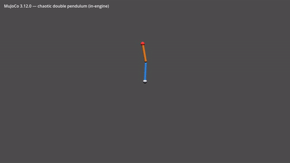
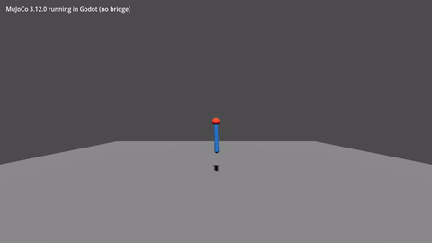
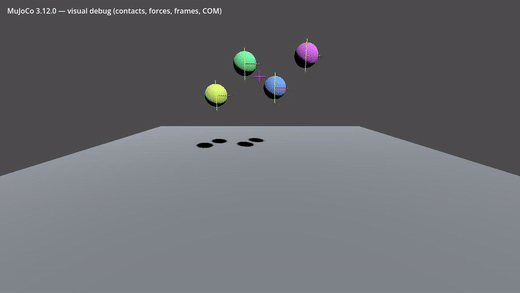

# godot-mujoco

**Full [MuJoCo](https://mujoco.org) physics inside Godot 4, as a native GDExtension.**

MuJoCo runs *in-engine* — there is **no bridge library** to call through and
**no manual MuJoCo install**. The MuJoCo runtime is downloaded and bundled
automatically by the build, and the extension is loaded directly by the engine.
It targets the **standard Godot build** (no .NET/Mono requirement) and exposes a
native `MjWorld` node usable from **GDScript and C#**.

> Scope: **desktop** (Linux / Windows / macOS). Mobile (iOS/Android) is a
> documented follow-up — see [Mobile](#mobile-ios--android).



*A chaotic double pendulum: MuJoCo integrates the dynamics entirely in-engine and
the joint state drives Godot nodes. See [`ChaosPendulum.tscn`](demo/ChaosPendulum.tscn).*

## Highlights

- One native node, `MjWorld`, owns a full MuJoCo `mjModel` + `mjData`.
- Zero-step packaging: `cmake --build` fetches + bundles MuJoCo and resolves it
  via `$ORIGIN` / `@loader_path` — no `LD_LIBRARY_PATH` / `DYLD_LIBRARY_PATH` /
  `PATH` changes.
- Usable from GDScript and C#; drop a node in a scene and simulate with zero code
  via the `auto_step` property.
- Batch state I/O, full body pose (position + orientation), sensors, and clock
  access for low-overhead per-tick integration.
- Built-in **visual debug** overlay (`MjDebugDraw`): contact points, force
  arrows, body frames, joint axes and center of mass.

## Requirements

- CMake ≥ 3.20 and a C++17 compiler (`g++` / `clang++` / MSVC).
- Network access on first configure (to fetch MuJoCo + godot-cpp).
- A standard Godot 4.7 binary to run the demo.

Nothing else — MuJoCo is fetched automatically.

## Build

```bash
cmake -S . -B build
cmake --build build -j
```

This will:

1. Download the pinned prebuilt **MuJoCo** release (default `3.12.0`) for your
   platform and verify its checksum.
2. Fetch and build **godot-cpp** (`godot-4.5-stable`, forward-compatible with
   Godot 4.6/4.7).
3. Build the extension and **stage everything** into
   `demo/addons/godot_mujoco/bin/`:
   - `libgodot_mujoco.<platform>.<target>.<arch>.so|.dylib|.dll`
   - the MuJoCo runtime (`libmujoco.so.3.12.0`, etc.)

> On distros whose default `cc`/`c++` points at Clang and can't find `libstdc++`,
> configure with `-DCMAKE_C_COMPILER=gcc -DCMAKE_CXX_COMPILER=g++`.

### Useful CMake options

- `-DMUJOCO_VERSION=3.12.0` — MuJoCo release to fetch.
- `-DGODOT_CPP_TAG=godot-4.5-stable` — godot-cpp tag to build against.
- `-DGMJ_ADDON_BIN=/path/to/bin` — where to stage the built binaries.

## Run

Visual demo (a MuJoCo-simulated pendulum driven every physics tick):

```bash
godot --path demo
```



Headless end-to-end proof (loads the model, steps the sim, prints joint state,
sensors and body pose, exits non-zero on failure — suitable for CI):

```bash
godot --headless --path demo res://HeadlessTest.tscn
```

Chaotic **double pendulum** — a visual demo and a headless test that shows
sensitive dependence on initial conditions (a 1e-5 rad perturbation diverges to
O(1)), which also exercises multi-instance isolation:

```bash
godot --path demo res://ChaosPendulum.tscn              # visual
godot --headless --path demo res://ChaosPendulumTest.tscn  # numerical chaos test
```

## Using `MjWorld` from GDScript

```gdscript
var world := MjWorld.new()
add_child(world)
world.load_model("res://models/pendulum.xml")

var motor := world.actuator_id("hinge_motor")
world.set_ctrl(motor, 0.15)
world.step(10)                                  # advance 10 MuJoCo steps

var body := world.body_id("pendulum")
print(world.body_world_transform(body))         # full pose (Transform3D)
print(world.get_qpos())                         # PackedFloat64Array
print(world.get_sensordata())                   # all sensor readings
```

Or with **zero code**: add an `MjWorld` node, set its `model_path` and enable
`auto_step` in the inspector.

### `MjWorld` API

- Lifecycle: `load_model(path)`, `free_model()`, `is_ready()`, `reset()`,
  `step(n=1)`, `forward()`
- Dimensions: `get_nq()`, `get_nv()`, `get_nu()`, `get_nbody()`, `get_njnt()`,
  `get_nsensor()`
- Clock: `get_time()`, `get_timestep()`, `set_timestep(dt)`
- Lookup: `body_id/joint_id/actuator_id/sensor_id(name)` and the matching
  `*_name(id)` accessors
- State: `get_ctrl(i)/set_ctrl(i,v)`, `get_qpos()/set_qpos()`,
  `get_qvel()/set_qvel()`, `get_ctrl_array()/set_ctrl_array()`
- Sensors: `get_sensordata()`, `get_sensor(sensor_index)`
- Kinematics: `body_world_position(i)` → `Vector3`,
  `body_world_quaternion(i)` → `Quaternion`, `body_world_transform(i)` →
  `Transform3D`
- Diagnostics: `get_mujoco_version()`, `get_last_error()`
- Debug: `get_ncon()` (active contacts), `get_kinetic_energy()`,
  `get_potential_energy()`, `get_warnings()`, `has_warnings()`,
  `get_debug_info()` (aggregate `Dictionary` snapshot)
- Visual debug: `get_contacts()`, `get_center_of_mass()`, `get_joint_anchor(i)`,
  `get_joint_axis(i)`, plus the `MjDebugDraw` overlay node
- Properties: `model_path`, `steps_per_tick`, `auto_step`

> MuJoCo is Z-up; Godot is Y-up. Kinematics queries return raw MuJoCo world-frame
> values — remap axes in your scene as needed. `mj_step` evaluates sensors before
> integrating, so call `forward()` if you need sensor/derived data consistent
> with the post-step state.

### Debugging

`get_debug_info()` returns a snapshot you can log each frame:

```gdscript
print(world.get_debug_info())
# { "mujoco_version": "3.12.0", "time": 1.5, "timestep": 0.01,
#   "nq": 1, "nv": 1, "nu": 1, "nbody": 2, "njnt": 1, "nsensor": 2,
#   "ncon": 0, "energy": { "potential": 24.3, "kinetic": 902.5, "total": 926.8 },
#   "warnings": {  } }

if world.has_warnings():
	push_warning("MuJoCo warnings: %s" % world.get_warnings())
```

Energy is a handy correctness signal — a passive system should approximately
conserve `get_kinetic_energy() + get_potential_energy()`. `get_warnings()`
surfaces MuJoCo's solver warnings (e.g. `BADQACC`, `CONTACTFULL`) by name, and
`get_ncon()` reports the number of active contacts.

### Visual debug

`MjDebugDraw` is a drop-in overlay node that renders MuJoCo's debug geometry —
**contact points, contact-force arrows, body frames, joint axes and the center
of mass** — as lines on top of your scene:

```gdscript
var dbg := MjDebugDraw.new()
add_child(dbg)
dbg.world = world              # point it at your MjWorld
dbg.show_contact_forces = true # toggles: frames / joints / com / contacts / forces
```



The underlying geometry is also exposed directly: `get_contacts()` (each with
`pos`, world-space `normal`, `force`, and penetration `distance`),
`get_center_of_mass()`, `get_joint_anchor(i)` and `get_joint_axis(i)`. See
[`VisualDebug.tscn`](demo/VisualDebug.tscn) for a runnable example — falling
balls whose resting contact forces sum to their weight.

## Using from C#

The extension registers `MjWorld` engine-wide, so it is equally available to C#
(`Godot.NET`) projects — construct `new MjWorld()`, add it to the tree, and call
the same methods. No P/Invoke and no separate bridge assembly.

## Project layout

```
CMakeLists.txt                     # fetches MuJoCo + godot-cpp, builds + bundles
src/                               # C++ GDExtension (MjWorld, registration)
demo/                              # standard Godot project (GDScript)
  addons/godot_mujoco/*.gdextension
  Main.tscn / HeadlessTest.tscn
  models/pendulum.xml
scripts/cloud_setup.sh             # idempotent CI / Cloud-Agent bring-up
```

## MuJoCo feature coverage

This binding exposes a **complete runtime-control surface** — enough to load
models, step the simulation, read/write full state, query poses and sensors, and
debug — but it does **not** wrap all of MuJoCo's very large C API. The native
`libmujoco` runtime is fully present; only the Godot-facing wrappers are curated.

**Implemented**

- Model/data lifecycle, `step`, `forward`, `reset`, multi-instance isolation
- Dimensions + name↔id lookup (bodies, joints, actuators, sensors)
- Full state I/O: `qpos`, `qvel`, `ctrl` (scalar + batch)
- Kinematics: body position, orientation, full `Transform3D`
- Sensors: all sensor data + per-sensor slices
- Clock: time / timestep
- Debug: energy, solver warnings, aggregate snapshot
- Visual debug: contact points / normals / forces, center of mass, joint axes,
  and the `MjDebugDraw` overlay

**Not yet wrapped** (native calls exist in `libmujoco`; wrappers can be added on
demand)

- External forces / applied torques (`xfrc_applied`, `qfrc_applied`), actuator
  force introspection
- Jacobians and inverse dynamics (`mj_jac*`, `mj_inverse`)
- Rich model introspection (geoms, sites, cameras, masses, joint ranges, gears)
- State save/restore (`mj_getState` / `mj_setState`), keyframes, mocap bodies
- Ray casting / collision queries (`mj_ray`), option/flag configuration
- Model editing (`mjSpec`), plugins, deformables/flex
- On-screen MuJoCo rendering (`mjr_*`) — intentionally omitted; Godot renders

Adding a wrapper is typically a few lines in `src/mj_world.cpp` plus a
`ClassDB::bind_method` entry. Open an issue for the calls you need.

## Mobile (iOS / Android)

Not included yet. MuJoCo ships **no official mobile prebuilts**, so mobile
requires cross-compiling the MuJoCo simulation core from source (Android NDK;
iOS toolchain) and linking it into a per-ABI GDExtension build (Android `.so`
per ABI; iOS static library / XCFramework). The simulation core has no
GPU/OpenGL dependency, so this is feasible as a follow-up.

## Roadmap

- Multi-phase plan: `docs/full_plan.md`
